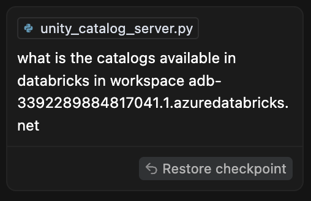
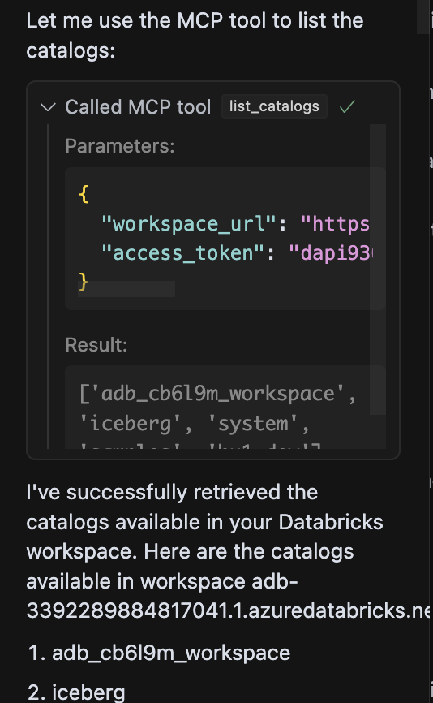
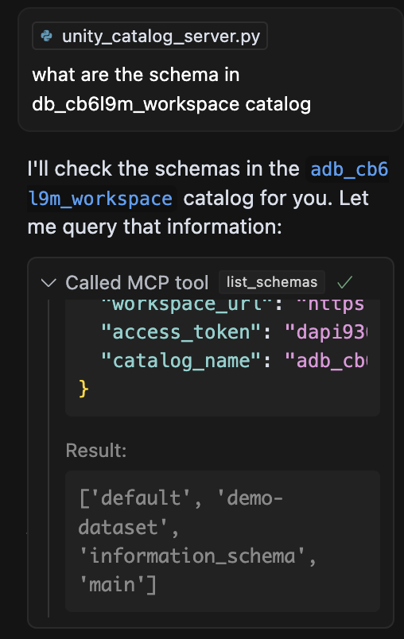
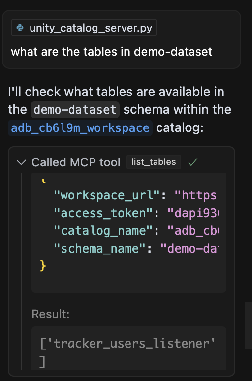

# Databricks MCP Tool

## Overview
This tool provides a server interface for interacting with Databricks Unity Catalog through the Model Context Protocol (MCP). It allows AI assistants and other applications to query Databricks metadata and explore data assets programmatically.

## Features
- **Unity Catalog Exploration**: Query catalogs, schemas, and tables in your Databricks workspace
- **MCP Protocol Support**: Implements the Model Context Protocol for AI assistant integration
- **Multiple Transport Options**: Supports both stdio and Server-Sent Events (SSE) transports
- **Environment Variable Configuration**: Easily configure with environment variables or direct parameters

## Recent Updates
- Separated the monolithic `unity_catalog_server.py` into modular components
- Added a standalone `run_server.py` script for easier execution
- Improved error handling and credential management
- Enhanced documentation and usage examples

## Installation
```bash
# Clone the repository
git clone https://github.com/yourusername/databricks-mcp-tool.git
cd databricks-mcp-tool

# Install dependencies
pip install -r requirements.txt

# Optional: Install in development mode
pip install -e .
```

## Configuration
Configure your Databricks credentials using one of these methods:

1. **Environment Variables**:
   ```bash
   export DATABRICKS_WORKSPACE_URL="https://your-workspace.cloud.databricks.com"
   export DATABRICKS_ACCESS_TOKEN="your-access-token"
   ```

2. **`.env` File**:
   Create a `.env` file in the project root:
   ```
   DATABRICKS_WORKSPACE_URL=https://your-workspace.cloud.databricks.com
   DATABRICKS_ACCESS_TOKEN=your-access-token
   ```

3. **Direct Parameters**:
   Pass credentials directly when calling functions or running the server.

## Usage

### Running the Server
```bash
# Using the run_server.py script (recommended)
python run_server.py --transport sse --port 8765

# Or using the module directly (if installed)
python -m mcp_databricks_tool --transport sse --port 8765
```

### Available Tools
The server exposes the following tools:

1. **list_catalogs**: Lists all catalogs in Unity Catalog
2. **list_schemas**: Lists all schemas in a specified catalog
3. **list_tables**: Lists all tables in a specified schema

### Example Queries
When integrated with an AI assistant, you can ask questions like:
- "What catalogs are available in my Databricks workspace?"
- "Show me all schemas in the 'samples' catalog"
- "List all tables in the 'main' schema of the 'adb_cb6l9m_workspace' catalog"

## Integrating with Cursor MCP

After starting the server, you can integrate it with Cursor using the Model Context Protocol (MCP). This allows Cursor's AI assistant to directly query your Databricks workspace.

### Configuration Options

You can configure the MCP server in Cursor using one of these methods (in order of recommendation):

#### 1. Project-specific Configuration (Recommended)

Create a `.cursor/mcp.json` file in your project directory:

```json
{
  "mcpServers": {
    "databricks-unity-catalog": {
      "transport": "sse",
      "url": "http://localhost:8765/sse"
    }
  }
}
```

#### 2. Global Configuration

For using this tool across all projects, create a `~/.cursor/mcp.json` file in your home directory:

```json
{
  "mcpServers": {
    "databricks-unity-catalog": {
      "transport": "sse",
      "url": "http://localhost:8765/sse"
    }
  }
}
```

#### 3. UI Configuration

While not recommended (as it doesn't support environment variables), you can also add the server through the Cursor UI:

1. Go to `Cursor Settings` > `Features` > `MCP`
2. Click `+ Add New MCP Server`
3. Select `SSE` as the transport type
4. Enter a server name (e.g., `databricks-unity-catalog`)
5. Enter the SSE endpoint URL: `http://localhost:8765/sse`

### Using the Tools in Cursor

Once configured, Cursor's Agent will automatically detect and use the Databricks tools when relevant. You can explicitly ask the Agent to use these tools with queries like:

- "Show me the catalogs in my Databricks workspace"
- "List the schemas in the samples catalog"
- "What tables are available in the main schema of my workspace catalog?"

### Tool Approval

By default, when Cursor's Agent wants to use an MCP tool, it will display a message asking for your approval. You can expand the message to see what arguments the Agent is using.

If you prefer, you can enable "Yolo mode" in Cursor settings to allow the Agent to run MCP tools without requiring approval.

## Example Results in Cursor

Below is an example of how the results appear in the Cursor chat window when using the Databricks MCP tools:

### Listing Catalogs





*Screenshot: Cursor Agent using the list_catalogs tool to display available catalogs in the Databricks workspace.*

### Listing Schemas in a Catalog



*Screenshot: Cursor Agent using the list_schemas tool to display schemas in a specific catalog.*

### Listing Tables in a Schema



*Screenshot: Cursor Agent using the list_tables tool to display tables in a specific schema.*

## Project Structure
- `mcp_databricks_tool/`: Main package directory
  - `unity_catalog_server.py`: Core server implementation
  - `__main__.py`: Entry point for running as a module
- `run_server.py`: Standalone script for running the server
- `requirements.txt`: Project dependencies

## Contributing
Contributions are welcome! Please feel free to submit a Pull Request.

## License
[Specify your license here]
