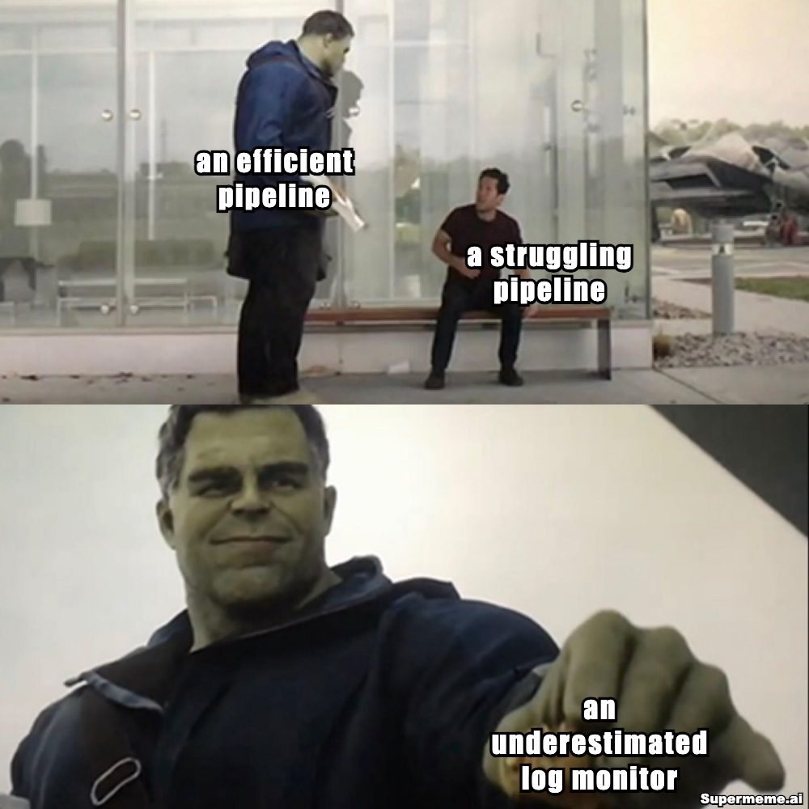

# code-snippets
Sample code snippets demonstrating Spark ETL with custom listener functionality

## Spark ETL with Listener
This code demonstrates how to implement a custom Spark listener to monitor and track ETL job progress. The listener captures key metrics and events during Spark job execution, including:

- Job start/completion times
- Stage progress tracking
- Task success/failure monitoring
- Performance metrics collection

### Key Features
- Custom SparkListener implementation
- Real-time job progress tracking
- Metric collection and monitoring
- Event logging capabilities

### Usage
The listener can be attached to any Spark application to provide enhanced monitoring and observability of ETL workflows.
